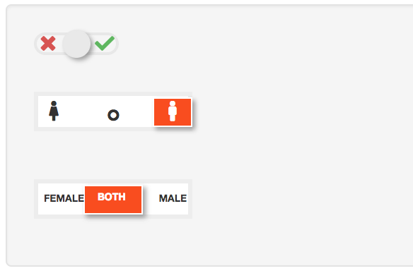

[](https://travis-ci.org/zappingseb/shinycandlestick)

# A custom shiny input for a Candle stick



This package creates a candle stick input. It allows to use a checkbox with three options
instead of just two. The function allows using the switch as it is or fontawesome icons
or text.

The main function to insert the input ist:
```
CandleStick(
  id = "fancycheckbox",
  left = c(f = "f182"),
  right = c(m = "f183"),
  default = c(b = "f22d"),
  fa_mode = TRUE,
  candlestick_mode = "contents",
  candlestick_size = "md",
  contents_color = '#fc4c02'
  )
```

with these settings it creates a switch with female, neutral and male icons. In Contents mode the color of
the switch can be changed.

